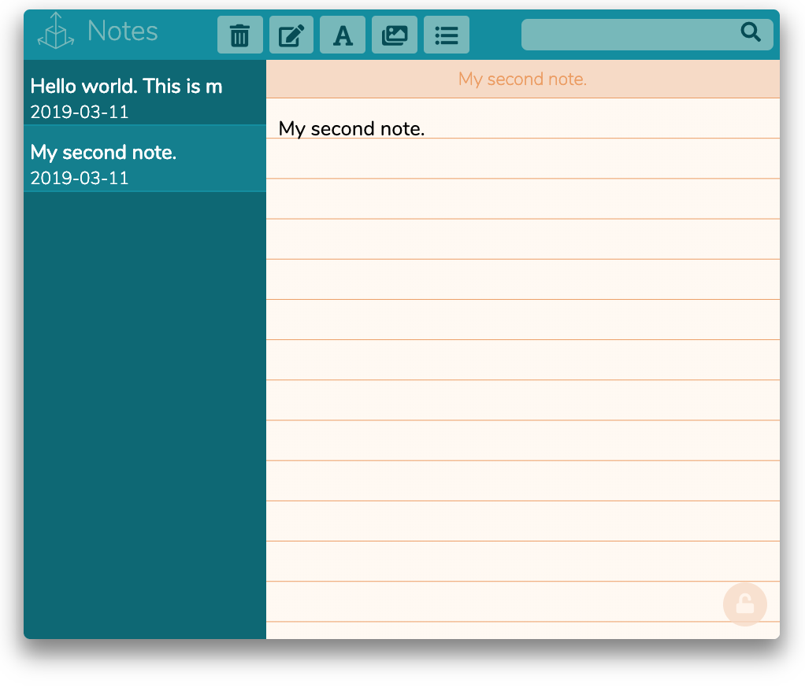

# The note taker v1.2 - ReactJs project

Inspired by MacOsX notes

## Things to fix

- [x] handle add new note
- [x] handle delete note
- [x] handle the delete errors
- [x] handle lock note
- [x] handle select note highlight
- [x] handle panel resize
- [ ] handle add pictures
- [x] text format
  - [x] bold
  - [x] italic
  - [x] underline
  - [x] strike-through
- [x] unordered list
- [x] rename on double click and enter
- [x] remove html entities from note title
- [ ] search feature
- [ ] local storage
- [ ] DB storage
